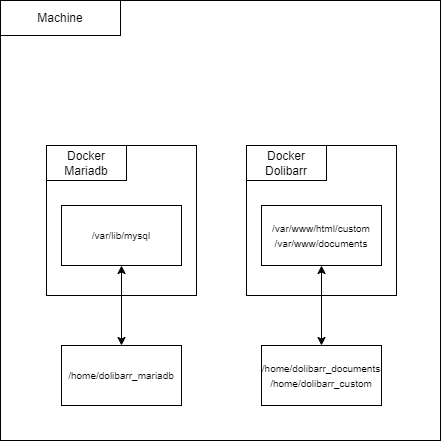

# Sae51-3 - Mise en place d'un ERP/CRM Dolibarr - Guide d'utilisation et de fonctionnement
**03/12/24**
***Valentin DAVID
Corentin CHRETIEN***

## Rappel de l'objectif

Vous etes responsable informatique dans l’entreprise XXX. La direction souhaite migrer
d’une solution ERP/CRM externalisee vers une solution hébergée en interne, basée sur le progiciel ”Dolibarr”. Elle a reussi a récuperer un export des données du prestataire actuel, sous la forme d’un ensemble de fichiers CSV (fichiers clients, fournisseurs, factures, commandes, etc.) La direction vous donne le cahier des charges suivants :
Faire l’etude de la mise en place d’un Dolibarr fonctionnel sur un serveur dédié hébergé dans l’entreprise. Ceci implique de considerer a la fois le coté installation, l’aspect import des donnees, et l’aspect sauvegarde des données. L’objectif final est d’arriver a une solution respectant les contraintes suivantes :

## Description


## Fonctionnement

Notre Docker Compose lance 2 conteneurs dont leur rôle est :
* Dolibarr fait .
* Mariadb s'occupe de stocker les données.

Afin de mieux comprendre, voici un schéma de leur fonctionnement :



## Mise en place
### Prérequis

Pour tester cette configuration, vous aurez besoin de :

* Docker et Docker Compose installés sur votre machine. 
  S'ils ne sont pas installés sur votre machine, effectuez les commandes suivantes :
  ``sudo apt install docker`` et ``sudo apt install docker-compose``.
* Un clone du projet avec les fichiers de configuration pour Grafana, Loki, Alloy et Nginx, ou bien le fichier Zip de ce projet.

### Démarrage du projet
1. Cloner le projet :
   ```
   git clone https://github.com/Exwyre/sae-dolibarr
   cd sae-dolibarr
   ```
2. Vérifier que le service docker-compose soit actif:
   ```
   systemctl status docker-compose
   ```   
3. Lancer le Docker-compose :
   ```
   docker-compose up -d
   ```   
4. Accéder à l'interface Grafana :

   Une fois que les conteneurs sont en marche (Cela peut prendre quelques secondes), vous pouvez accéder à Grafana via votre navigateur à l'URL suivante :
   ```
   http://localhost:8085
   ```   
5. Se connecter dans l'ERP/CRM

    Les logins sont admin / admin

6.  Importer les données

## Ce que vous devriez voir à l'exécution
Lorsque le projet est en marche,


## Points clés du projet
* Ce qui a bien fonctionné :
  * point fonctionel

* Problèmes rencontrés :
  * Au début: dockerfile prb sur le lien entre db et dolibarr pour migrer vers docker compose
