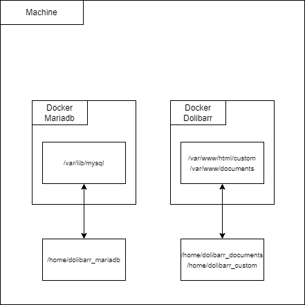
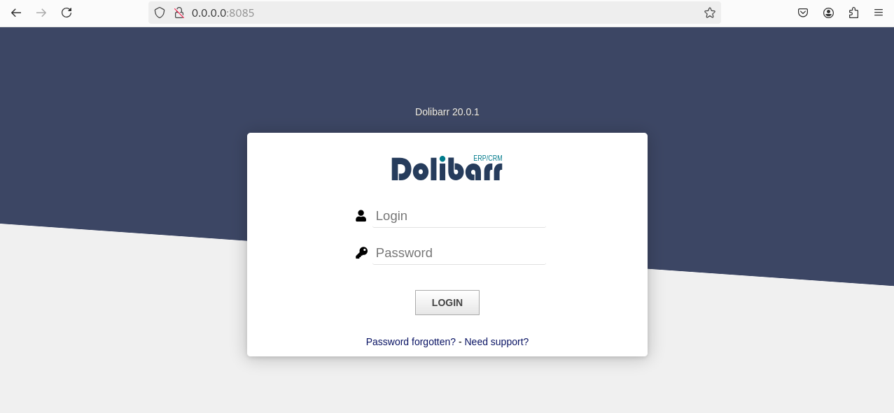
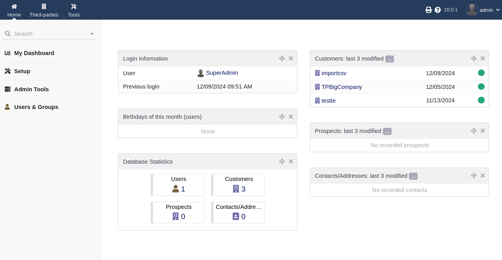

# Sae51-3 - Mise en place d'un ERP/CRM Dolibarr - Guide d'utilisation et de fonctionnement
**08/12/24**
***Valentin DAVID
Corentin CHRETIEN***

## Rappel de l'objectif

Vous etes responsable informatique dans l’entreprise XXX. La direction souhaite migrer d’une solution ERP/CRM externalisee vers une solution hébergée en interne, basée sur le progiciel ”Dolibarr”. Elle a reussi a récuperer un export des données du prestataire actuel, sous la forme d’un ensemble de fichiers CSV (fichiers clients, fournisseurs, factures, commandes, etc.) La direction vous donne le cahier des charges suivants : Faire l’etude de la mise en place d’un Dolibarr fonctionnel sur un serveur dédié hébergé dans l’entreprise. Ceci implique de considerer a la fois le coté installation, l’aspect import des donnees, et l’aspect sauvegarde des données. L’objectif final est d’arriver a une solution respectant les contraintes suivantes :

## Description


## Fonctionnement

Notre Docker Compose lance 2 conteneurs dont leur rôle est :
* Dolibarr correspond au logiciel ERP/CRM
* Mariadb s'occupe de stocker les données de dolibarr.

Afin de mieux comprendre, voici un schéma de leur fonctionnement :



## Mise en place
### Prérequis

Pour tester cette configuration, vous aurez besoin de :

* Docker, Docker Compose et zip installés sur votre machine. 
  S'ils ne sont pas installés sur votre machine, effectuez les commandes suivantes :
  ``sudo apt install docker``, ``sudo apt install docker-compose`` et ``sudo apt install zip``.
* Un clone du projet avec les fichiers de configuration pour Mariadb ainsi que Dolibarr.

### Démarrage du projet
1. Cloner le projet :
   ```
   git clone https://github.com/Exwyre/sae-dolibarr
   cd sae-dolibarr
   ```
2. Vérifier que le service docker-compose soit actif:
   ```
   systemctl status docker-compose
   ```   
3. Lancer le script d'installation :
   ```
   bash install.sh
   ```   
4. Accéder à l'interface Dolibarr :

   Une fois que les conteneurs sont en marche (Cela peut prendre quelques secondes), vous pouvez accéder à Dolibarr via votre navigateur à l'URL suivante :
   ```
   http://localhost:8085
   ```
   Ou bien:
   ```
   http://0.0.0.0:8085
   ```
6. Se connecter dans l'ERP/CRM

    Les logins sont admin / admin

### Import et sauvegarde des données

1. Pour importer des données, vous devez modifier le fichier csv en remplissant les information nécessaire. Puis dans un terminal, entrer la commande suivante
   ```
   bash import_csv.sh
   ```
2.  La sauvegarde automatique
  Pour vérifier que la sauvegarde automatique est bien fonctionnel, entrer dans un terminal la commande:
  ```
  crontab -l
  ```
  Si la sauvegarde est bien activé, vous devrier voir cet ligne:
  ```
  0 1 * * * /backup/sauvegarde.sh
  ```
  Sinon, entrer ces lignes de commandes dans le terminal:
  ```
  echo "0 1 * * * /backup/sauvegarde.sh" > temp
  crontab temp
  rm temp
  ```
  Ainsi, dès qu'un sauvegarde seras effectuer, elle seras présente dans le dossier backup. De plus, le fichier sont compresser et sont effacer après une semaine.

3. Pour faire une sauvegarde manuelle
  Si vous souhaitez effectuer un sauvegarde manuelle, effectuer cette commande dans le dossier backup:
  ```
  zip -r "$(date +"%Y-%m-%d")_backup_manuelle.zip" "/home/dolibarr_mariadb"
  ```
4. Relance suite à une sauvegarde
  Si vous souhaiter revenir sur une sauvegarde passée, dans le dossier backup, effectuer cette commande:
  ```
  unzip DateDeLaSauvegarde_backup.zip -d /home/dolibarr_mariadb
  ```
## Ce que vous devriez voir à l'exécution
Lorsque le projet est en marche, vous dervriez arriver sur cette page

Une fois connéctée (pour rappel, les logins sont admin/admin), voici ce que vous devez voir:

Afin de vérifier que des clients on bien été ajouter à la base de données, le nombre de "Customers" devrait affiché et ne pas être égale à 0.

## Points clés du projet
* Ce qui a bien fonctionné :
  * 
  * Répartition du travail entre nous

* Problèmes rencontrés :
  * Au début: dockerfile prb sur le lien entre db et dolibarr pour migrer vers docker compose
